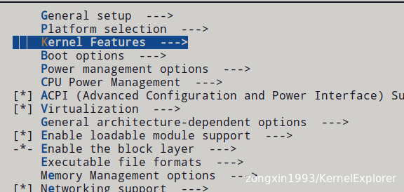
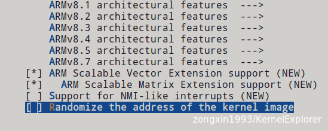
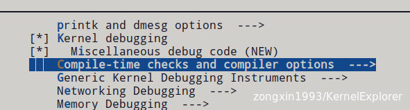
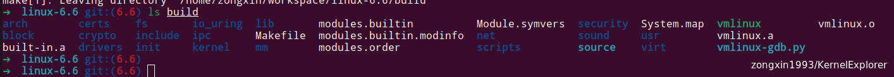
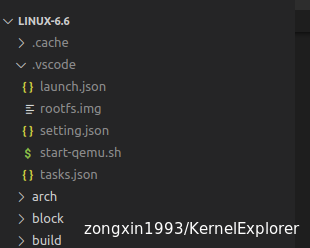
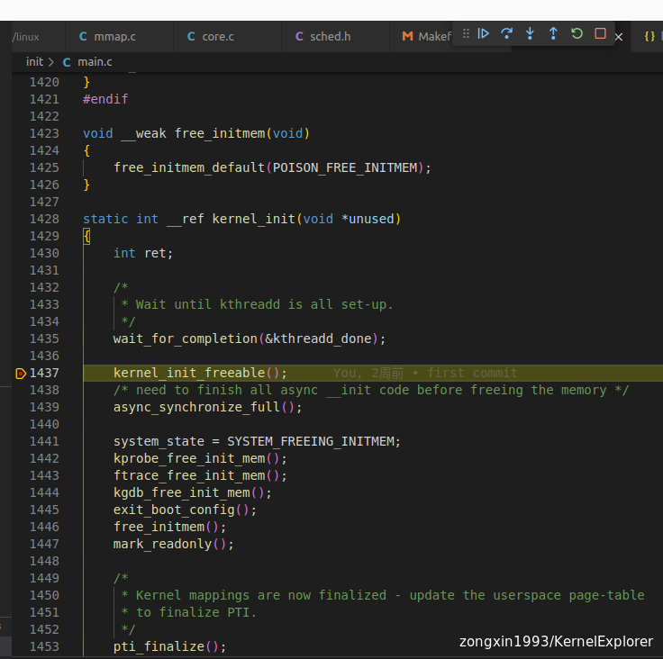

# Linux kernel Debug 环境搭建

## Busybox 环境配置编译

```
## 截稿时最新Busybox 版本
wget https://busybox.net/downloads/busybox-1.36.1.tar.bz2
tar -xvf busybox-1.36.1.tar.bz2
cd busybox-1.36.1/
make ARCH=arm64 CROSS_COMPILE=aarch64-linux-gnu- menuconfig

# 把busybox配置为静态编译，找到Settings —>，enter进入子目录，找到并选择
# [*] Build static binary (no shared libs)
# 选中后退出保存编译

make ARCH=arm64 CROSS_COMPILE=aarch64-linux-gnu- -j
```


## Rootfs制作

```
# 在busybox-1.36.1文件夹下使用dd命令创建文件，并格式化为ext4文件系统。
dd if=/dev/zero of=rootfs.img bs=1M count=10
mkfs.ext4 rootfs.img
```


```
cd busybox-1.36.1/
# 使用mount命令将rootfs.img挂载到fs目录，编译busybox并写入fs目录中。
mkdir fs
sudo mount -t ext4 -o loop rootfs.img ./fs
sudo make ARCH=arm64 CROSS_COMPILE=aarch64-linux-gnu- install CONFIG_PREFIX=./fs
```


```
# 接下来对写入的busybox进行补充配置，注意切换路径。
cd fs/
sudo mkdir proc dev etc home mnt
sudo cp -r ../examples/bootfloppy/etc/* etc/
cd ..
sudo chmod -R 777 fs/
```


```
# 最后，卸载rootfs.img
sudo umount fs
```

&nbsp;

## Linux Kernel 下载配置编译

```
# 下载解压源码
wget -c https://git.kernel.org/pub/scm/linux/kernel/git/stable/linux.git/snapshot/linux-6.6.tar.gz
tar -zxvf linux-6.6.tar.gz 
cd linux-6.6

# 配置config
make ARCH=arm64 CROSS_COMPILE=aarch64-linux-gnu- O=build menuconfig

#需要 关闭地址随机化 和 打开 允许GDB调试 kernel debugging （Kernel hacking —> 找到Compile-time checks and compiler options —>）；如下图

# 然后退出保存编译
bear -- make ARCH=arm64 CROSS_COMPILE=aarch64-linux-gnu- O=build -j
```









&nbsp;

编译完成后生成kernel 文件



&nbsp;

## VScode 单步Debug kernel

```
# 将 .vscode 文件夹复制到 Linux kernel 工程根目录
# 将 构建的 rootfs.img 复制到 .vscode 目录中
cd ${KERNEL_ROOT_PATH}
cp ../busybox-1.36.1/rootfs.img ./.vscode
```



```
# 然后在init/main.c 文件中 kernel_init 函数中 kernel_init_freeable 处打一个断点
# 然后点debug task按键，进行debug（过程中白色弹框 点“仍要调试即可”）其最后如图所示
# 现在kernel可以单步调试了
```


