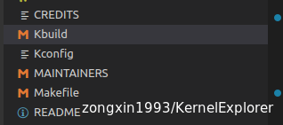
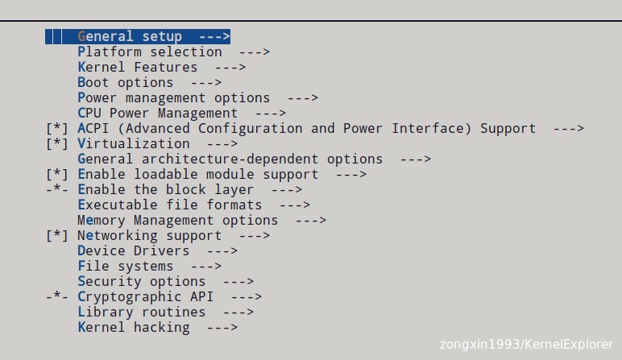
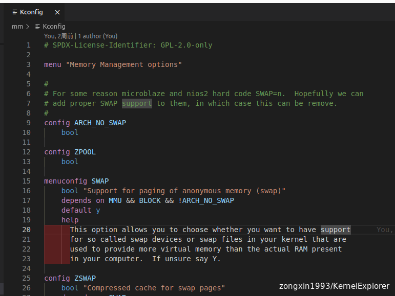
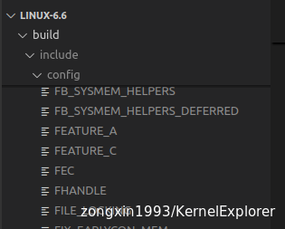
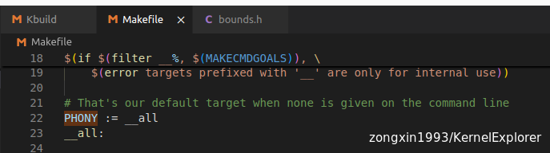
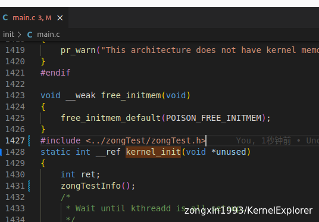
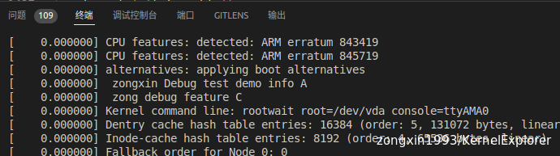

# Linux Kernel 代码的基本配置编译原理及过程

主要的配置命令

```
make config           #比较繁琐，不推荐
make oldconfig        #常用于内核升级，提示新内核特性
make menuconfig       #常用
make xconfig          #X界面的配置方式
make gconfig          #GTK界面的配置方式
make defconfig        #使用默认的配置
make allyesconfig     #所有配置选项设置为yes
make allmodconfig     #所有选项配置为module
```

&nbsp;当我们在执行 make menuconfig 时，Kernel 依靠工程根目录的三个文件进行控制配置工程的



Kconfig 本身是Linux 社区为了应对kernel日渐复杂的配置选项而产生的一种工具，现在已经渗透到kernel 相关的工程，如buildroot 和Busybox等。

因为linux kernel重要代码均为C语言编写，所以其核心编译过程还是Make命令进行。

- **Kconfig**    ---> （几乎所有源码目录下）提供选项，用来动态生成修改config配置
- **.config**     ---> （源码顶层目录下）保存选择结果
- **Makefile**   ---> （几乎所有源码目录下）根据.config中的内容来告知编译系统如何编译
- **Kbuild**      --->  （主要在arch 和driver目录下）根据.config 中的内容动态调整编译生成的组件，动态修改Make时候最后kernel bin所链接的.o文件

&nbsp;

# Kconfig

Kconfig 本身也是树状结构，在工程本目录的Kconfig文件为根节点，然后导入各个子目录的Kconfig文件


仔细看这些导入文件的排列，是和menuconfig是出现的图形界面的名称是可以对应上的



主要对于关系如下

| <span style="color: #ce9178;">fs/Kconfig.binfmt</span> | <span style="color: #ce9178;">Executable file formats</span> |
| --- | --- |
| <span style="color: #ce9178;">mm/Kconfig</span> | <span style="color: #ce9178;">Memory Management options</span> |
| <span style="color: #ce9178;">net/Kconfig</span> | <span style="color: #ce9178;">Networking support</span> |
| <span style="color: #ce9178;">drivers/Kconfig</span> | <span style="color: #ce9178;">Device Drivers</span> |
| <span style="color: #ce9178;">fs/Kconfig</span> | <span style="color: #ce9178;">File systems</span> |
| <span style="color: #ce9178;">security/Kconfig</span> | <span style="color: #ce9178;">Security options</span> |
| <span style="color: #ce9178;">crypto/Kconfig</span> | <span style="color: #ce9178;">Cryptographic API</span> |
| <span style="color: #ce9178;">lib/Kconfig</span> | <span style="color: #ce9178;">Library routines</span> |
| <span style="color: #ce9178;">lib/Kconfig.debug</span> | <span style="color: #ce9178;">Kernel hacking</span> |

&nbsp;

因为menuconfig 是根据Kconfig 中的特定格式的描述生成的图形界面，所以在选择kernel feature的时候其实需要对kernel的层级目录结构也是要有清晰的认识

### Kconfig 语法

Kconfig 的语法相对比较简单，主要由8个元素组成：

- 配置项的定义：用于声明一个配置选项，常见的bool，int，string，enum
- 依赖关系：使得某些选项只有在特定条件下才可见
- 帮助文档：帮助文本用于提供配置项的详细说明
- 条件语句：来控制配置项的可见性和有效性
- 菜单：将相关的配置项组织在一起
- 选择：让用户从多个选项中选择一个
- 提示：用于在配置菜单中显示提示信息
- 默认值：配置项设置默认值。

下例为mm中的Kconfig 文件示意：  


### Kconfig Demo

我们在Kernel 工目录下新建一个目录，自己编写一个Kconfig
```
cd ${KERNEL_SOURCE}
mkdir zongTest
touch zongTest/Kconfig

# 然后在根目录中的Kconfig文件中插入下面文字导入 Kconfig 文件
source "zongTest/Kconfig"

# 然后在Kconfig 填写如下文字：

```

```
menu "Zongxin Test Menu"

config FEATURE_A
    bool "Feature A"
    default y # 默认启用
    help
        This is the help text for Feature A.

config FEATURE_B
    bool "Feature B"
    depends on FEATURE_A # 只有当 FEATURE_A 启用时才可见
    help
        This is the help text for Feature B.

    prompt "Feature Configuration (Feature B)"

if FEATURE_A
    config FEATURE_C
        bool "Feature C"
        default y # 默认启用
endif

if ! FEATURE_A
    config FEATURE_D
        bool "Feature D"
endif

menu "Advanced Features" # 子菜单
    config FEATURE_E
        bool "Feature E"
    config FEATURE_F
        bool "Feature F"
endmenu

choice
    prompt "Select Feature E Option"
    depends on FEATURE_E
config FEATURE_G
    bool "FEATURE_G"
    select FEATURE_G_1
    select FEATURE_G_2
endchoice

endmenu

```

执行 `make ARCH=arm64 CROSS_COMPILE=aarch64-linux-gnu- O=build menuconfig`，在最下方选择"Zongxin Test Menu"


然后保存退出，查看.config 文件最下方


&nbsp;

# Kbuild 与 Makefile

在执行过**make menuconfig** 之后，会生成.config文件，文件中详细描述了所有 Kernel使能的feature，Makefile根据config 文件进行编译产生了类似于“多态”的效果

查看根目录下Makefile中的内容约 800行处


在配置好config以后，执行`make ARCH=arm64 CROSS_COMPILE=aarch64-linux-gnu- O=build` 的时候，会在build目录（我指定了生成的编译文件输出目录是build，为了保证源码目录的整洁），会在`include/generated/ and include/config/`目录下生成对应的配置内容，如下图：



其中 config下的文件是只有文件名字的空白文件，autconfig,h 是编译时候控制kernel 代码中宏文件使用的FLAG

`Kbuild` 的本质是一个特殊的Makefile，它是用来构建 Linux 内核及其模块的定制化。`Kbuild`系统使用了`Makefile`的语法，并添加了一些特定的约定和宏来简化内核构建过程。

**Kbuild** 中加入了一下特殊的宏和条件判断，用来处理简化复杂的kernel 编译条件，比方说：`obj-m` 和`obj-y`

在编译时`make ARCH=arm64 CROSS_COMPILE=aarch64-linux-gnu- O=build`  make命令默认调用的是\*\*\__all\*\*命令：



# Kbuild Demo

根据之前的config 简单写一个测试程序

1.  在kernel 根目录下面的Kbuild文件中加入`obj-y += zongTest/`
    
2.  在kernel 根目录下新建zongTest目录并创建
    
    ```
    cd ${KERNEL_SOURCE}
    mkdir zongTest
    # touch zongTest/Kconfig 上一步已有
    touch zongTest/Makefile
    touch zongTest/zongTest.h
    touch zongTest/zongTestA.c
    touch zongTest/zongTestD.c
    
    ```
    
3.  写入对应文件内容
    
    ```
    # Makefile
    obj-$(CONFIG_FEATURE_A)				+= zongTestA.o
    obj-$(CONFIG_FEATURE_D)				+= zongTestD.o
    
    # zongTest.h
    #ifndef __ZONGTEST_H__
    #define __ZONGTEST_H__
    void zongTestInfo(void);
    #endif 
    
    # zongTestA.c
    #include <linux/printk.h>
    #include "zongTest.h"
    
    void zongTestInfo() {
        pr_notice(" zongxin Debug test demo info A\n");
    #ifdef CONFIG_FEATURE_B
        pr_notice(" zong debug feature B\n");
    #elif CONFIG_FEATURE_C
        pr_notice(" zong debug feature C\n");
    #endif
    }
    
    # zongTestD.c
    #include <linux/printk.h>
    #include "zongTest.h"
    
    void zongTestInfo() {
        pr_notice(" zongxin Debug test demo info: D\n");
    }
    ```
    
4.  在kernel 启动初始化函数中调用测试函数，查看打印信息，在`init/main.c`文件中添加头文件引用，在`kernel_init`函数中引用测试函数，如下图；
    
5.  重新编译运行，`bear -- make ARCH=arm64 CROSS_COMPILE=aarch64-linux-gnu- O=build -j30`，结果如下
6.  在menuconfig时候，使能不同的feature，可以控制编译的source文件及代码分支，也是kernel “多态”的一种体现!，如下图就勾选了FEATURE_D的结果 

&nbsp;

&nbsp;

&nbsp;