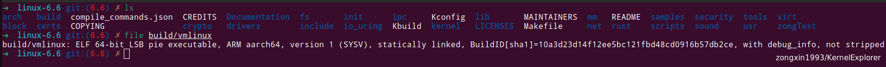
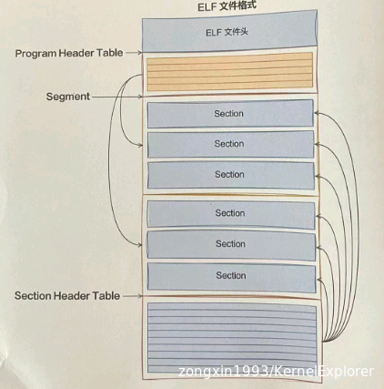
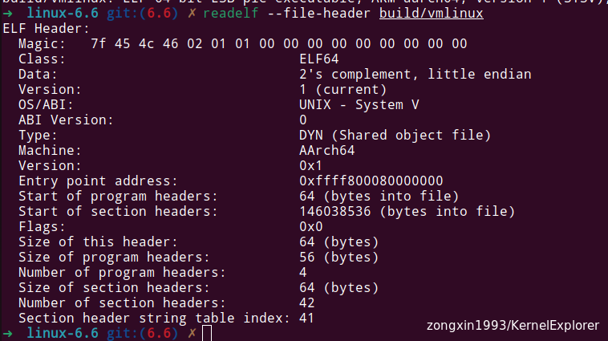
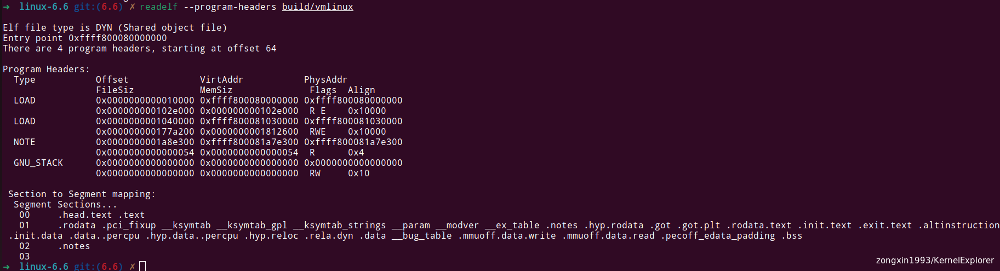
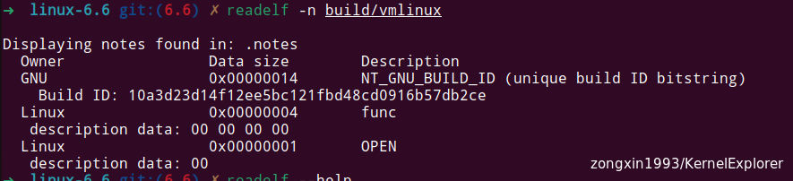
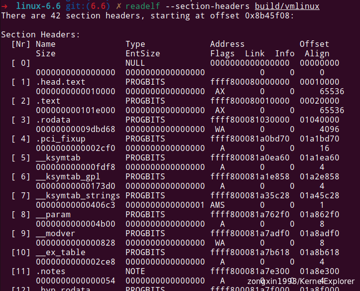
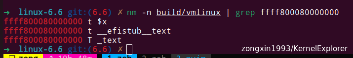
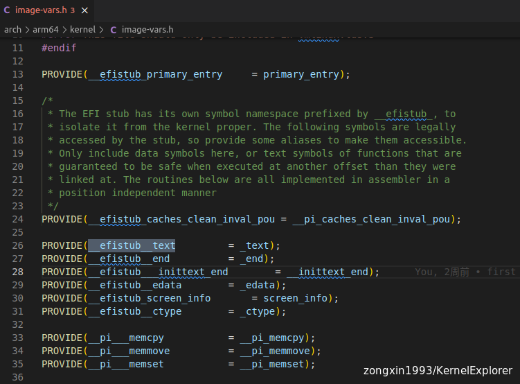
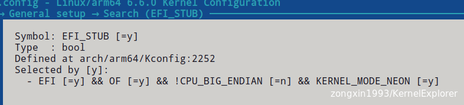

Linux 在编译后可以根据不同的需求，生成多种镜像格式，本文详解最原始最根本的vmlinux文件

# vmlinux

vmlinuz是可引导的、可压缩的内核镜像，vm代表Virtual Memory.Linux支持虚拟内存，因此得名vm。它是由用户对内核源码编译得到，实质是elf格式的文件也就是说，vmlinux是编译出来的最原始的内核文件，未压缩，本质上是一个可执行文件

要看懂vmlinux 到底是什么，有什么用，要从ELF开始讲起（这个在Linux上很关键）

## ELF可执行文件格式

**ELF**的全称是Executable Linkable Format，是种二进制文件格式。Linux下的目标文件、可执行文件和CoreDump都按该格式进行存储,LSB的全称是Linux Standard Base，它是Linux标准规范。其目的是制定一系列标准来增强inux发行版的兼容性。ARM aarch64表示该可执行文件支持的CPU架构。

**PIE**（Position-Independent Executable）是指位置无关的可执行文件。这类可执行文件在加载到内存时不需要固定在一个特定的地址上，而是可以在内存中的任何位置加载和执行。与vm字段相对应，与**PDE** Position-Dependent Executable）是指位置相关的可执行文件相对立。

ELF文件由四部分组成，分别是ELF文件头(ELFHeader)、Program Header TableSection和Section Header Table，如图所示。

### ELF文件头

ELF文件头记录了整个文件的属性信息。原始的二进制形式不利于观察，但是可以通过使用**readelf**工具进行查看

- Magic：一串特殊的识别码，主要用于快速对这个文件进行识别，看他是不是ELF文件
- Class：表示这是一个ELF64的文件
- Type：EXEC是可执行文件，REL是可重定位目标文件，DYN是动态链接库，CORE是codedump文件
- Entry point address：程序入口地址
- Size of this header：ELF文件头的大小，这里显示占用了64字节
- Start of program headers: Program header的位置
- Size of program headers:每一个Program header的大小
- Number of program headers:总共有多少个Program header
- Start of section headers: Section header的开始位置
- Size of section headers:每一个Section header的大小
- Number of section headers:总共有多少个Section header

### Program Header Table

Program Header Table就是所有Segment的头信息，是用来描述所有Segment的

在中文中 Segment 和 Section 的意思比较接近，但其实Section 是由编译连接器生成的，都有着不同的用处，比方说 我们写的代码放在.text Section中，全局变量放在.data或者.bass Section中，对于操作系统其实不关心它到底是什么，只想知道他的读写执行权限等信息，所以把有着相同权限的Section 放在一起组成了Segment，让系统更快的加载

上面的结果显示总共有4个Program Header。对于每一个Segment，输出了Type、Offset、VirtAddr、FileSize、Flags等描述当前Segment的信息。其中:

- Offset：表示当前Segment在二进制文件中的开始位置
- VirtAddr：表示加载到虚拟内存后的地址
- PhysAddr：表示加载到物理内存后的地址
- FileSiz：表示当前Segment的大小
- Flag：表示当前Segment的权限类型，R表示可读、E表示可执行、W表示可写

在最下面，还展示了每个Segment是由哪几个Secton组成的，比如00号Segment 由".head.text .text”2个Section组成的。

其中Segment的Type类型虽然包括PHDR、INTERP、LOAD、DYNAMIC、NOTE.GNU EH FRAME、GNU STACK、GNU_RELRO等多种，但只有LOAD是需要被加载到内存中供运行时使用的。GNU_STACK 是一种特殊的 ELF 段，用于控制程序栈的分配和属性，通常没有内容用以描述在这段的权限。是一种用于存储 ELF 文件中额外元数据（可以使用readelf -n 查看细节，如下图）

### Section Header Table

和Program Header able 不一样的是，Section Header Table 直接描述每一个Section。其实这二者描述的都是各种Section，只不过目的不同，一个针对加载（Program Header Table），一个针对链接（Section Header Table）

结果显示，该文件总共有41个Section，每个Secion也都有一些固定的字段用来描述当前Section的信息（这个很重要）。在二进制文件中的位置通过offset列表示。Section的大小通过size列体现。

### 各种Section

Section 有很多种类型，每种类型都有其特定的作用，也可以认为定义新的Section (后面看 汇编时候能看到)，常见的比较重要的就是.text、.data、.bss

## EntryPoint 查看

之前我们看到了程序的入口地址是0xffff800080000000，可以看看它到底是什么，这次我们使用nm命令进行查看。nm命令可以查看可执行文件中的符号及地址信息。

可以看到，入口地址指向了_\_text 这个全局变量（T代表全局）也是_\_efistub_\_text 这个局部变量的地址（t代码局部），所以我们在代码中搜索_\_efistub_\_text字段，可以得到当下Kernel编译参数时，入口函数是什么

这里可以看到，使用了EFISTUB的启动方式，官方文档： [https://docs.kernel.org/admin-guide/efi-stub.html](https://docs.kernel.org/admin-guide/efi-stub.html "efi-stub")

Arm64配置下EFISTUB是默认引导方式，根据上面的分析，linux kernel的本质也是一个可执行文件，所以想要启动kernel，就需要所谓的引导程序，那么谁来启动Linux内核呢，基于KISS(keep it simple and stupid)原则，一个简单的思路就是用一个更简单的内核（或者说一段程序）来启动真正的内核，在UEFI/EFI系统上，使用EFISTUB，它允许主板直接引导到内核，某种意义上说，它就是kernel内嵌的引导加载程序。

所以vmlinux的入口地址实际上是EFISTUB的入口地址！！！

&nbsp;