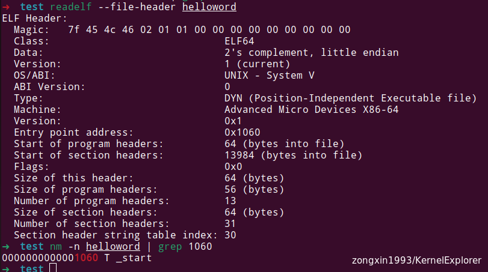
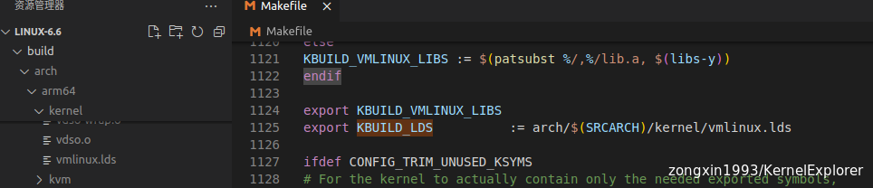
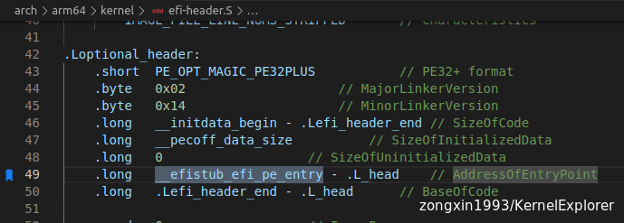
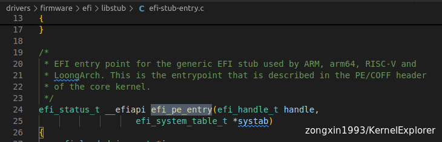
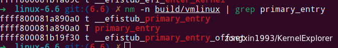
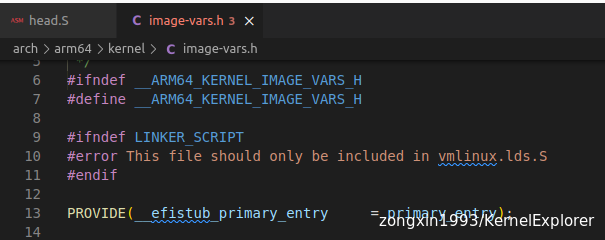
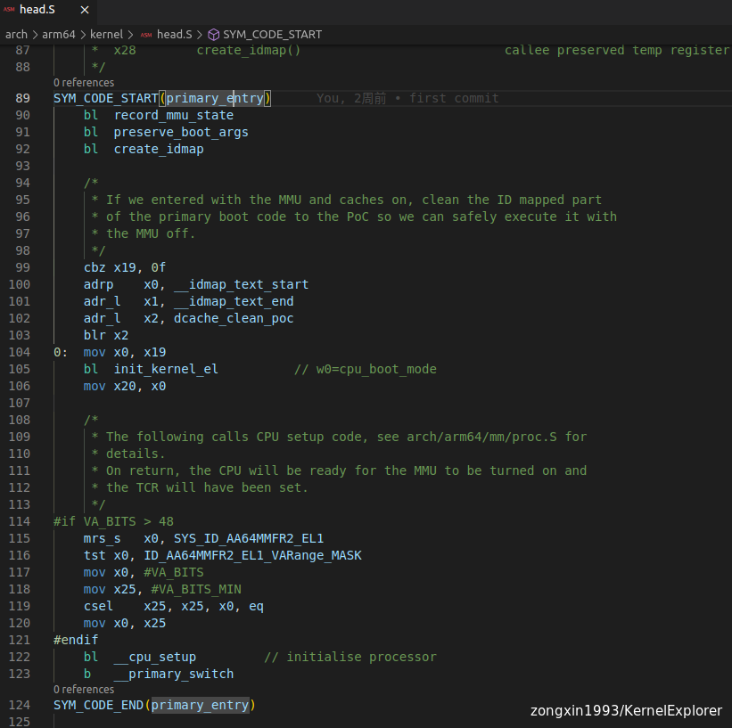

# 抽丝剥茧kernel入口函数

**上文我们知道了vmlinux的入口地址其实是EFISTUB的地址，那么真正的kernel入口地址是什么那？**

在正常开发时候，代码的编译主要分为两步

1.  使用编译器将source code 编译生成为object 文件
2.  将多个可重定向文件进行链接组成一个可执行文件

通常c/c++ 的入口地址是main函数，但是实际上，在系统的眼中并不是main，main函数只是glibc封装过，为了方便开发者使用而创造的统一接口，详情可以看一下glibc源码的实现(大概在**start.S**中)，而对于一个c/c++的binary，一般情况下真正的入口函数是 **\_start**,下面是一个简单是示例说明：

```
# helloword.c
#include <stdio.h>
int main() {
    printf("Hello, World!\n");
    return 0;
}

gcc helloword.c -o helloword

```



但是linux kernel作为内核，根据第二篇文章，在编译时通过config，可以生成不同的object文件，所以需要通过vmlinux.lds文件进行细致化的内存布局和指定入口函数

所以如果把helloword看成一个kernel，那glibc就是那个EFISTUB，反之也是一样的，在kernel真正的入口函数前面包裹了一些前处理的操作。

# vmlinux.lds

Linux kernel在编译时，先根据config文件生成了对应的单独feature的 object 文件，然后根据`vmlinux.lds.S` 文件生成链接用的vmlinux.lds，最后的成果会放在`arch/$(SRCARCH)/kernel/vmlinux.lds`



在vmlinux.lds 声明了vmlinux的入口函数

```
OUTPUT_ARCH(aarch64)
ENTRY(_text)
jiffies = jiffies_64;
PECOFF_FILE_ALIGNMENT = 0x200;

........
........

PROVIDE(__efistub_primary_entry = primary_entry);
PROVIDE(__efistub_caches_clean_inval_pou = __pi_caches_clean_inval_pou);
PROVIDE(__efistub__text = _text);
PROVIDE(__efistub__end = _end);
PROVIDE(__efistub___inittext_end = __inittext_end);
PROVIDE(__efistub__edata = _edata);
PROVIDE(__efistub_screen_info = screen_info);
PROVIDE(__efistub__ctype = _ctype);
PROVIDE(__pi___memcpy = __pi_memcpy);
PROVIDE(__pi___memmove = __pi_memmove);
PROVIDE(__pi___memset = __pi_memset);

.......
.......
```

此处可以和上一讲的最后，通过nm命令看到的入口地址是`__efistub__text`相吻合

根据官方文档的描述，其主要代码在<span style="color: #3e4349;">`libstub/arm64-stub.c` 和<span style="color: #3e4349;">`libstub/arm64.c` 及 `efi-header.S`三个个文件</span></span>

```
For arm64, there is no compressed kernel support, so the Image itself masquerades as a PE/COFF image and 
the EFI stub is linked into the kernel. The arm64 EFI stub lives in drivers/firmware/efi/libstub/arm64.c and
drivers/firmware/efi/libstub/arm64-stub.c.
```

根据汇编显示，EFISTUB的入口地址函数是`efi_pe_entry`，先记住汇编相关的以后再讲





1.  先调用`efi_kaslr_relocate_kernel` 函数将kernel地址随机化，KASLR（Kernel Address Space Layout Randomization） 是一种安全特性，它通过随机化内核的加载地址来提高系统的安全性，使得内核的基地址不再是固定的，从而增加了攻击者预测内核布局的难度，默认开启，CONFIG_RANDOMIZE_BASE进行控制
2.  检查平台基础的feature，加载initrd等通用操作
3.  为fdt模块分配新的内存，为退出boot进入kernel做准备（这部分和设备树相关，下一讲细讲）
4.  最后会执行到`efi_enter_kernel` 函数进行初始化

```c
# drivers\firmware\efi\libstub\arm64.c
void __noreturn efi_enter_kernel(unsigned long entrypoint,
                 unsigned long fdt_addr,
                 unsigned long fdt_size)
{
    void (* __noreturn enter_kernel)(u64, u64, u64, u64);

    enter_kernel = (void *)entrypoint + primary_entry_offset();
    enter_kernel(fdt_addr, 0, 0, 0);
}

# drivers\firmware\efi\libstub\arm64-stub.c
asmlinkage void primary_entry(void);
unsigned long primary_entry_offset(void)
{
    /*
     * When built as part of the kernel, the EFI stub cannot branch to the
     * kernel proper via the image header, as the PE/COFF header is
     * strictly not part of the in-memory presentation of the image, only
     * of the file representation. So instead, we need to jump to the
     * actual entrypoint in the .text region of the image.
     */
    return (char *)primary_entry - _text;
}
```

最后可以看出实际上执行的是一个函数指针，并且带了4个参数，第一位是fdt的地址，而函数指针的地址是 `_text` 地址+offset （根据上下文可知_text 地址本质就是vmlinux的入口地址），这个命令是类似函数跳转，所以实际问题就是 `primary_entry` 的地址(或者说函数)是谁？

通过`nm`命令可以看出`primary_entry`的真正地址偏移是多少



也符合`arch/arm64/kernel/image-vars.h`的定义



`primary_entry` 是一个汇编函数定义在`drivers\firmware\efi\libstub\arm64-stub.c` 文件中，实现在`arch\arm64\kernel\head.S` 汇编代码中



这个入口函数开始进行 Arm64 相关的ATF 及平台初始化汇编代码，和platform强相关，对于Linux系统本身通用功能部分影响不大，基本也不会改动他，这里不多做讲解（以后单讲）

顺着`primary_entry`函数入口，一直往下找 `b` 开头的函数调用（Arm64 指令集汇编中 `b`代表函数跳转，`bl`代表函数调用），可以看到整体的汇编函数调用流程如下：

```asm
--->primary_entry
    --->__primary_switch
        --->__primary_switched
            --->start_kernel

#in function __primary_switched
SYM_FUNC_START_LOCAL(__primary_switched)
    ...
    mov	x0, x20
    bl	finalise_el2			// Prefer VHE if possible
    ldp	x29, x30, [sp], #16
    bl	start_kernel
    ASM_BUG()
SYM_FUNC_END(__primary_switched)
```

&nbsp;从代码中可以看到，最后跳转到了`start_kernel`函数，并且无限loop中，返回就报错。

而`start_kernel` 函数本身实现在`init/main.c`中,可以看到从`start_kernel` 这个函数开始也就是进入到我们熟悉的C语言中了，也就是我们kernel传统意义上的程序入口(相当于helloword的main函数)

```
asmlinkage __visible __init __no_sanitize_address __noreturn __no_stack_protector
void start_kernel(void)
{
    char *command_line;
    char *after_dashes;

    set_task_stack_end_magic(&init_task);
    smp_setup_processor_id();
    debug_objects_early_init();
    init_vmlinux_build_id();

    cgroup_init_early();

    local_irq_disable();
    early_boot_irqs_disabled = true;
    ...
}
```

&nbsp;