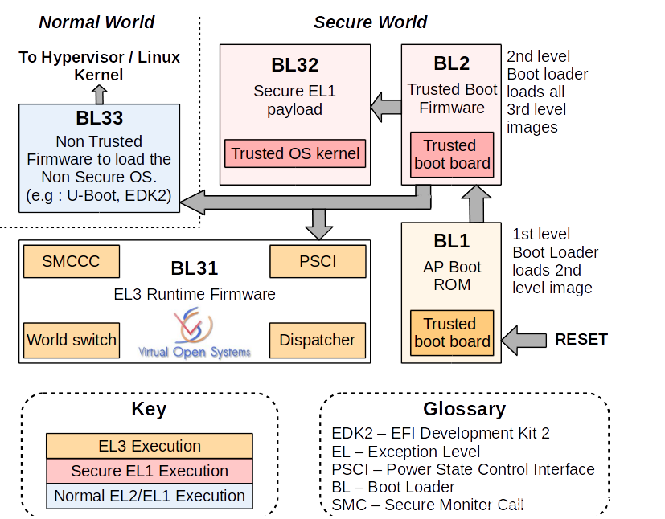
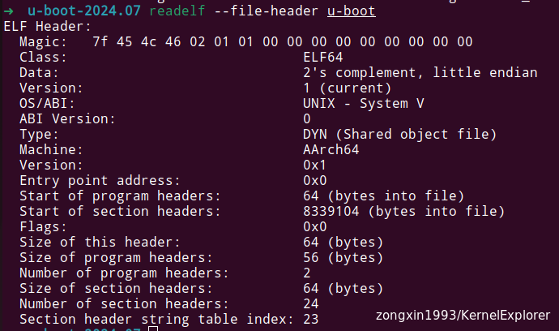
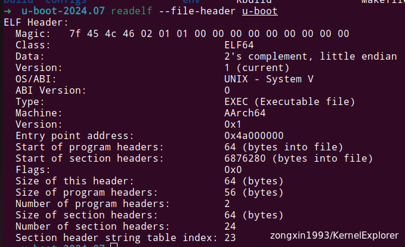
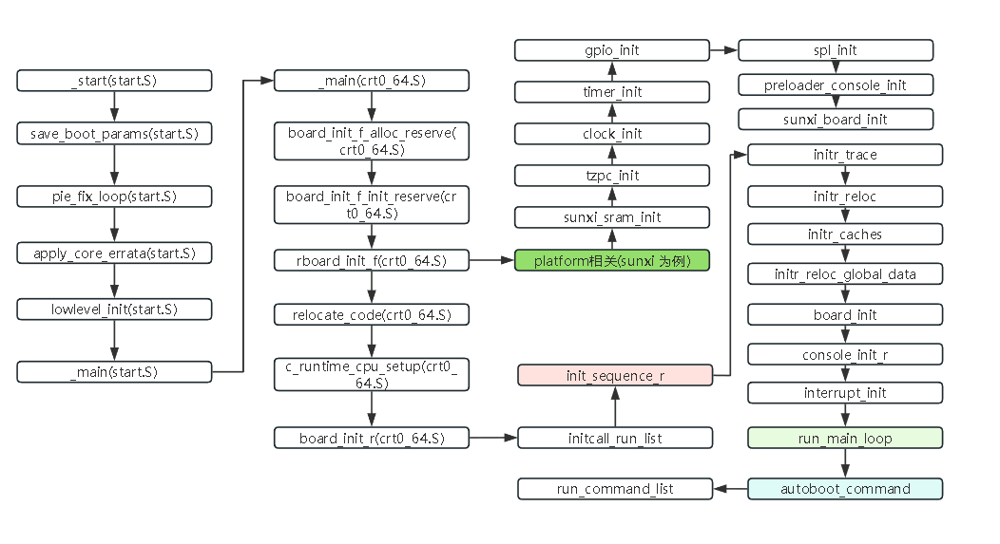
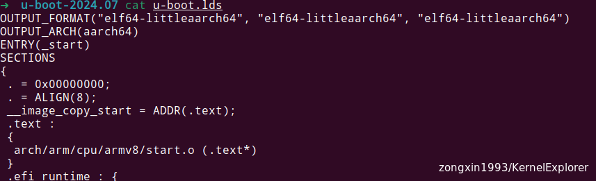
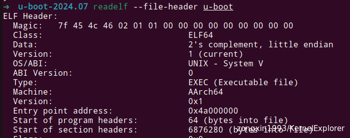
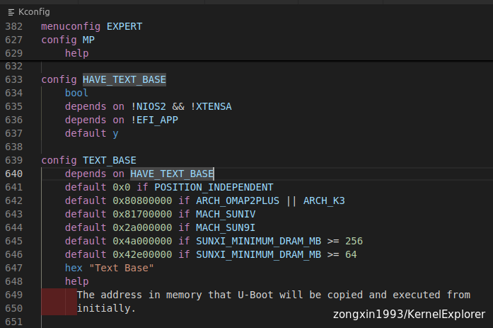
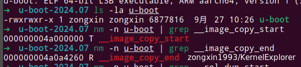

Bootloader 是一个通用概念，也就是标准的字面意思，在启动的过程中负责初始化硬件设备，并加载操作系统内核或其他软件到内存中执行的一种裸机程序。

在Arm64下用的最多的就是u-boot（Universal Boot Loader）,U-Boot可以在各种嵌入式平台上运行，包括但不限于ARM、PowerPC、x86等架构。它支持多种引导设备，如Flash存储器、SD卡、MMC卡、网络等，下面简单编译一下uboot源码

# ATF（Arm Trusted Firmware



上图是Arm官网的ATF架构图，在芯片上电时，

先执行 BL1 层BootRom里面厂商写好的最基础的启动程序。

然后跳转到BL2层的镜像，此时DDR还没有被初始化，因此它需要被加载到片内的SRAM中执行.

<然后BL31、BL32和BL33都是由BL2加载的，其中BL31和BL32是可选的，若系统不支持TRUST OS，则可去掉BL32，若不支持EL3异常等级及secure monitor，则可去掉BL31。

BL33一般指uboot，一般通过它最终启动操作系统内核。

# U-boot 的基础

```
sudo apt build-dep u-boot
wget -c https://github.com/u-boot/u-boot/archive/refs/tags/v2024.07.tar.gz
tar -zxvf v2024.07.tar.gz
cd u-boot-2024.07

make CROSS_COMPILE=aarch64-linux-gnu- qemu_arm64_defconfig
make CROSS_COMPILE=aarch64-linux-gnu- -j

# 简单试一下
qemu-system-aarch64 -machine virt -nographic -cpu cortex-a53 -bios u-boot.bin
```

根据之前的经验，简单看一下uboot的入口函数和lds文件配置



可以看到在编译选项是qemu的时候，EP 的地址是`0x0`，但是这个地址是和**硬件设计**强相关的，我们如何换一个编译配置，就会得到不同的数值，如下面：



然后我们看一下`u-boot.lds`文件，相对来说uboot的功能比较简单，所以也没有linux kernel 那么多“炫技”般的Section，就是简简单单的描述一下入口函数和几个主要的Section，但是声明了一个重要的事情，.text Section的代码来自于`arch/arm/cpu/armv8/start.o`

```asm
OUTPUT_FORMAT("elf64-littleaarch64", "elf64-littleaarch64", "elf64-littleaarch64")
OUTPUT_ARCH(aarch64)
ENTRY(_start)
SECTIONS
{
 . = 0x00000000;
 . = ALIGN(8);
 __image_copy_start = ADDR(.text);
 .text :
 {
  arch/arm/cpu/armv8/start.o (.text*)
 }
 ....
 ....
}

```

为什么说这个重要那，因为为了兼容性和是裸机程序的原因，不同架构的芯片都有各自的start.S 汇编代码，所以在编译时候到底用谁了(工程里面重名比较多)，这个还是很关键的！

整体的前处理主要由汇编组成，涉及Arm64的架构设计，一般也不会改动，先略过（日后进阶时细讲），主要梳理一下主要汇编函数的调用。



要搞懂这一系列操作在干什么，首先要直到，代码(程序)是怎么存储的，又是如何读取(使用)的

# norflash、nandflash、SRAM 和 SDRAM 的区别

- nor flash - 是非易失性存储器（也就是掉电保存）

NOR flash 带有 SRAM 接口，有足够的的地址引脚进行寻址，可以很容易地读取其内部的每一个字节，上电后可以读取 norflash 中的数据但是不可以进行写操作。

- nand flash - 是非易失性存储器（也就是掉电保存）

它也是非易失闪存（掉电不丢失）的一种，但是它虽然有数据总线，但是没有地址总线，所以 cpu 不能直接从 nandflash 中取指运行，由于它价格便宜，所以常常用来存储大量数据，和我们常说的硬盘类似。

- SRAM - 静态随机访问存储器 - Static Random Access Memory

*static* 是指只要不掉电，存储在 SRAM 中的数据就不会丢失，RAM 是一种易失性存储器，它只有在电源保持连续供应的情况下才能够保持数据。*Random Access* 指的是存储器的内容可以任意顺序进行访问，而不管前一次访问的是哪一个位置。上电后就可以读写 SRAM 中的数据，而无需初始化操作

- SDRAM - 同步动态随机存取存储器 - Synchronous Dynamic Random Access Memory

需要不断的刷新，才能保存数据。而且是行列地址复用，许多都有页模式。需要对 DDR 控制器进行初始化 &lt;配置寄存器&gt;，才能去读写 SDRAM 中的数据

# U-boot 启动流程

在U-boot启动时，根据u-boot.lds 链接文件的描述，会根据不同的硬件平台产生不同EP地址，如第一章描述，在配置u-boot 为qemu_arm64_defconfig 时，起始地址0x00，而如果是orangepi_zero3_defconfig时，起始地址变成了0x4a000000。

为甚会这样那？我们重新编译一个板子的u-boot（以orangepi_zero3_defconfig为例）

```
# 下载ATF代码
git clone https://github.com/ARM-software/arm-trusted-firmware.git
cd arm-trusted-firmware
make CROSS_COMPILE=aarch64-linux-gnu- PLAT=sun50i_a64 bl31

export BL31=${ATF_PATH}/build/sun50i_a64/release/bl31.bin

# 编译uboot代码
cd ${UBOOT_PATH}
make CROSS_COMPILE=aarch64-linux-gnu- orangepi_zero3_defconfig
make CROSS_COMPILE=aarch64-linux-gnu- -j
```

查看ELF和uboot.lds 信息的区别





可以看到，u-boot.lds 文件中的编译链接EP地址是 0x00，但是实际ELF文件的EP地址是0x4a000000，为什么会这样那？

查看基础的Kconfig 信息，起始是平台设置的默认值，起始对于程序来说，0x00就是编译的起始地址它指向了代码的第一条命令，而这个命令到底在真机上面跑在那个物理地址上面，起始是和硬件设计强相关的，所以在lds文件中默认的是0x00，厂家根据自己的实际硬件情况，再LD时候对这个值进行修改。



我们从新回到lsd文件，有2个变量比较有意思  
\__image_copy_start(u-boot拷贝的起始地址)  
\__image_copy_end(u-boot拷贝的结束地址)



因为在程序启动时，外置RAM一般都是不可用的状态，所以uboot会先加载到SRAM中，但是一般芯片的SRAM 会比较小，放不下u-boot 的binary ，所以需要先加载uboot的部分代码，然后由 uboot加载全部代码，到RAM中继续执行。

根据上面的流程图，在调用过`board_init_f` 以后，板子的基础功能已经可以，所以通过`relocate_code` 汇编函数，将_\_image_copy_start到_\_image_copy_end 标记的代码复制到RAM中继续执行(为什么将程序复制到别的地方，还可以继续运行，下一节详细讲)

```
ENTRY(relocate_code)
    stp	x29, x30, [sp, #-32]!	/* create a stack frame */
    mov	x29, sp
    str	x0, [sp, #16]
    /*
     * Copy u-boot from flash to RAM
     */
    adrp	x1, __image_copy_start		/* x1 <- address bits [31:12] */
    add	x1, x1, :lo12:__image_copy_start/* x1 <- address bits [11:00] */
    subs	x9, x0, x1			/* x9 <- Run to copy offset */
    b.eq	relocate_done			/* skip relocation */
    /*
     * Don't ldr x1, __image_copy_start here, since if the code is already
     * running at an address other than it was linked to, that instruction
     * will load the relocated value of __image_copy_start. To
     * correctly apply relocations, we need to know the linked value.
     *
     * Linked &__image_copy_start, which we know was at
     * CONFIG_TEXT_BASE, which is stored in _TEXT_BASE, as a non-
     * relocated value, since it isn't a symbol reference.
     */
    ldr	x1, _TEXT_BASE		/* x1 <- Linked &__image_copy_start */
    subs	x9, x0, x1		/* x9 <- Link to copy offset */

    adrp	x1, __image_copy_start		/* x1 <- address bits [31:12] */
    add	x1, x1, :lo12:__image_copy_start/* x1 <- address bits [11:00] */
    adrp	x2, __image_copy_end		/* x2 <- address bits [31:12] */
    add	x2, x2, :lo12:__image_copy_end	/* x2 <- address bits [11:00] */
copy_loop:
    ldp	x10, x11, [x1], #16	/* copy from source address [x1] */
    stp	x10, x11, [x0], #16	/* copy to   target address [x0] */
    cmp	x1, x2			/* until source end address [x2] */
    b.lo	copy_loop
    str	x0, [sp, #24]

    /*
     * Fix .rela.dyn relocations
     */
    adrp	x2, __rel_dyn_start		/* x2 <- address bits [31:12] */
    add	x2, x2, :lo12:__rel_dyn_start	/* x2 <- address bits [11:00] */
    adrp	x3, __rel_dyn_end		/* x3 <- address bits [31:12] */
    add	x3, x3, :lo12:__rel_dyn_end	/* x3 <- address bits [11:00] */
fixloop:
    ldp	x0, x1, [x2], #16	/* (x0,x1) <- (SRC location, fixup) */
    ldr	x4, [x2], #8		/* x4 <- addend */
    and	x1, x1, #0xffffffff
    cmp	x1, #R_AARCH64_RELATIVE
    bne	fixnext

    /* relative fix: store addend plus offset at dest location */
    add	x0, x0, x9
    add	x4, x4, x9
    str	x4, [x0]
fixnext:
    cmp	x2, x3
    b.lo	fixloop

relocate_done:
    switch_el x1, 3f, 2f, 1f
    bl	hang
3:	mrs	x0, sctlr_el3
    b	0f
2:	mrs	x0, sctlr_el2
    b	0f
1:	mrs	x0, sctlr_el1
0:	tbz	w0, #2, 5f	/* skip flushing cache if disabled */
    tbz	w0, #12, 4f	/* skip invalidating i-cache if disabled */
    ic	iallu		/* i-cache invalidate all */
    isb	sy
4:	ldp	x0, x1, [sp, #16]
    bl	__asm_flush_dcache_range
    bl     __asm_flush_l3_dcache
5:	ldp	x29, x30, [sp],#32
    ret
ENDPROC(relocate_code)
```

然后调用initcall_run_list 根据配置按顺序执行init_sequence_r 函数指针数组中的函数，最后到达autoboot_command 执行预设好的bootcmd完成引导工作