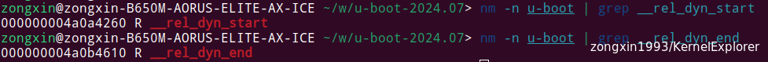

# Uboot 中的代码重定位

`ld` 命令是 Linux 中的链接器，用于将目标文件和库链接成可执行文件或共享库。在使用 `ld` 时，`-pie` 选项和`-fPIC`、`-fPIE` 选项是与位置无关的代码（Position Independent Code）相关的。下面是这些选项的简要说明：

1.  **`-pie`**（Position Independent Executable）:
    
    - 这个选项告诉链接器生成一个位置无关的可执行文件（PIE）。PIE 文件可以在内存中的任何位置运行，这对于提高安全性非常重要，因为它允许操作系统使用地址空间布局随机化（ASLR）来降低缓冲区溢出攻击的风险。
2.  **`-fPIC`**（Position Independent Code）:
    
    - 这个选项用于编译器（如 GCC），用于生成位置无关代码的选项。当你编译共享库时，应该使用 `-fPIC`，这样生成的代码可以在内存中的任何位置执行。它适用于创建可以被多个进程共享的库。
3.  **`-fPIE`**（Position Independent Executable）:
    
    - 这个选项也是用于编译器，它与 `-fPIC` 类似，但专门用于生成位置无关的可执行文件（PIE）。使用 `-fPIE` 编译的代码可以作为可执行文件的输入，通常与 `-pie` 选项一起使用。

&nbsp;

<span style="color: #444444;">uboot的编译选项发现，在arch/arm/config.mk，如下：</span>

```
# 大约109号位置

# needed for relocation
LDFLAGS_u-boot += -pie
```

uboot只指定了-pie给ld，而没有指定-fPIC或-fPIE给gcc。

指定-pie后编译生成的uboot中就会有一个rela.dyn段，uboot就是靠rela.dyn段实现了relocation！

回顾一下u-boot.lds

```
{
...
 . = ALIGN(8);
 __image_copy_end = .;
 .rela.dyn : {
  __rel_dyn_start = .;
  *(.rela*)
  __rel_dyn_end = .;
 }
 _end = .;
 .bss ALIGN(8) : {
  __bss_start = .;
  *(.bss*)
  . = ALIGN(8);
  __bss_end = .;
 }
...
}
```



下面逐行分析一下`relocate_64.S` 文件，看是如何进行relocate的

```asm
ENTRY(relocate_code)
    // 初始化RAM栈指针，sp是aarch64 栈指针寄存器
    // 将X29和X30 的值存在 sp起始偏移-32的位置，32是10进制数
    stp	x29, x30, [sp, #-32]!
    //将 X29寄存器的值给SP
    mov	x29, sp
    // 将X0 的值放到 sp起始偏移16的位置
    str	x0, [sp, #16]

    // 将__image_copy_start 的地址 copy到 X1寄存器的高20位中
    adrp	x1, __image_copy_start
    // 这里和上面是一个组合，将低12位进行填充，让X1是一个完整的__image_copy_start的地址
    add	x1, x1, :lo12:__image_copy_start
    // 这里算了一下，X0是RAM的目标地址，X1是想要Copy的其实地址，算了一下地址偏移量
    subs	x9, x0, x1
    // 这里是一个条件判断语句，类似于do while，检查relocate_done 是否为真(是否完成relocate)
    b.eq	relocate_done

    // 将CONFIG_TEXT_BASE 配置的Base地址给X1寄存器
    ldr	x1, _TEXT_BASE
    // 计算出两个之间的地址偏移
    subs	x9, x0, x1
    
    // 将 __image_copy_start 的地址和 __image_copy_end 分别赋值给X1和X2
    adrp	x1, __image_copy_start
    add	x1, x1, :lo12:__image_copy_start
    adrp	x2, __image_copy_end
    add	x2, x2, :lo12:__image_copy_end
copy_loop:
    // 从X1 开始地址复制2位 到寄存器 X10 和X11（SRAM），X1往后偏移16位
    ldp	x10, x11, [x1], #16	
    // 从 X10 和 X11 中复制到 X0 地址长度2位（RAM），X0 往后偏移16位
    stp	x10, x11, [x0], #16
    // 比较X1 和X2的 值，也就是需要copy 的代码区域start和end是否重合	
    cmp	x1, x2	
    // 如何 start 小于end 那么继续跳转执行 copy_loop函数，类似于C中递归
    b.lo	copy_loop
    // 完成 copy 代码的loop后，将X0 的值放到 sp起始偏移24的位置
    str	x0, [sp, #24]

    // 将__rel_dyn_start和__rel_dyn_end 的值给X2 和X3寄存器
    adrp	x2, __rel_dyn_start
    add	x2, x2, :lo12:__rel_dyn_start
    adrp	x3, __rel_dyn_end
    add	x3, x3, :lo12:__rel_dyn_end
fixloop:
    // 开始从X2 开始复制2位到X0和X1
    ldp	x0, x1, [x2], #16
    // 将X2 中的值8位赋值给X4，然后X2的值往后偏移8位	
    ldr	x4, [x2], #8
    // 将X1 按位与操作，得到低8位的值
    and	x1, x1, #0xffffffff
    // 然后比较X1 和 R_AARCH64_RELATIVE 的值
    cmp	x1, #R_AARCH64_RELATIVE
    // 跳转条件判断，if为真 则跳转fixnext，继续进行循环操作
    bne	fixnext

    // 将X9中的offset 地址偏移量加到X0 和X4中
    add	x0, x0, x9
    add	x4, x4, x9
    // 将X4 的值给X0中
    str	x4, [x0]
fixnext:
    // 比较X2 和X3的值，也就是__rel_dyn_start 和__rel_dyn_end
    cmp	x2, x3
    // 如过__rel_dyn_start 小于__rel_dyn_end 这继续copy，类似于递归
    b.lo	fixloop

relocate_done:
    // 这是一个伪指令，相当于switch case
    switch_el x1, 3f, 2f, 1f
    bl	hang
    // 取sctlr_el3寄存器的值给X0，然后跳转0f位置，这是一个错误分支相当于重启
3:	mrs	x0, sctlr_el3
    b	0f
    // 取sctlr_el2寄存器的值给X0，然后跳转0f位置，这是一个错误分支相当于重启
2:	mrs	x0, sctlr_el2
    b	0f
1:	mrs	x0, sctlr_el1
0:	tbz	w0, #2, 5f	/* skip flushing cache if disabled */
    tbz	w0, #12, 4f	/* skip invalidating i-cache if disabled */
    ic	iallu		/* i-cache invalidate all */
    isb	sy
    // 调用清除缓存的汇编代码
4:	ldp	x0, x1, [sp, #16]
    bl	__asm_flush_dcache_range
    bl     __asm_flush_l3_dcache
    // 最后赋值X29和X30从SP中取2位，然后然SP偏移32位，然后return完成relocate
5:	ldp	x29, x30, [sp],#32
    ret
ENDPROC(relocate_code)
```

可以看到 relocate就是 uboot 将自身拷贝到 RAM 的另一个地放去继续运行(RAM 的高地址处)。  
一个可执行的 bin 文件，其链接地址和运行地址要相等，也就是链接到哪个地址， 在运行之前，就要拷贝到哪个地址去。现在我们重定位以后，运行地址就和链接地址不同了  
当简单粗暴的将uboot从0X4a400000 拷贝到其他地方以后，关于函数调用、全局变量引用就会出问题。Uboot对于这个的处理方法就是采用位置无关码，这个就需要借助于 .rele.dyn段。