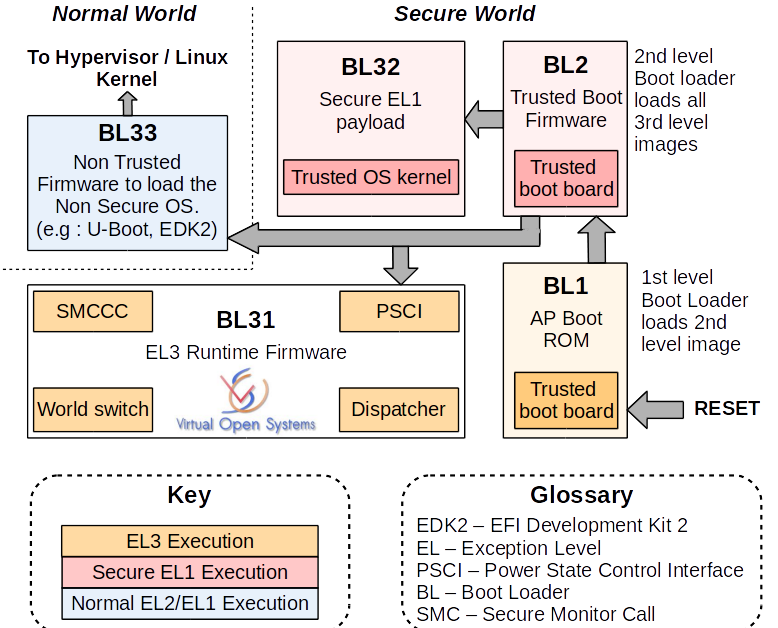

# Arm的ATF-A(Arm Trusted Firmware-A)

## 冷启动(Cold boot)流程及阶段划分



官网文档：https://trustedfirmware-a.readthedocs.io/en/latest/index.html

ATF冷启动实现分为5个步骤：

- BL1 - AP Trusted ROM，一般为BootRom。
- BL2 - Trusted Boot Firmware，一般为Trusted Bootloader。
- BL31 - EL3 Runtime Firmware，一般为SML，管理SMC执行处理和中断，运行在secure monitor中。
- BL32 - Secure-EL1 Payload，一般为TEE OS Image。
- BL33 - Non-Trusted Firmware，一般为uboot、linux kernel。

ATF输出BL1、BL2、BL31，提供BL32和BL33接口。

==***EL(Exception Level)相关的后面再讲***==

## BL1

BL1位于ROM中，在EL3下从reset vector处开始运行。

BL1做的工作主要有：

- 决定启动路径：冷启动还是热启动。
- 架构初始化：异常向量、CPU复位处理函数配置、控制寄存器设置(SCRLR_EL3/SCR_EL3/CPTR_EL3/DAIF)
- 平台初始化：使能Trusted Watchdog、初始化控制台、配置硬件一致性互联、配置MMU、初始化相关存储设备。
- 固件更新处理
- BL2镜像加载和执行：
    - BL1输出“Booting Trusted Firmware"。
    - BL1加载BL2到SRAM；如果SRAM不够或者BL2镜像错误，输出“Failed to load BL2 firmware.”。
    - BL1切换到Secure EL1并将执行权交给BL2.

## BL2

BL2位于SRAM中，运行在Secure EL1主要工作有：

- 架构初始化：EL1/EL0使能浮点单元和ASMID。
- 平台初始化：控制台初始化、相关存储设备初始化、MMU、相关设备安全配置、
- SCP_BL2：系统控制核镜像加载，单独核处理系统功耗、时钟、复位等控制。
- 加载BL31镜像：BL2将控制权交给BL1；BL1关闭MMU并关cache；BL1将控制权交给BL31。
- 加载BL32镜像：BL32运行在安全世界，BL2依赖BL31将控制权交给BL32。SPSR通过Secure-EL1 Payload Dispatcher进行初始化。
- 加载BL33镜像：BL2依赖BL31将控制权交给BL33。

## BL31

BL31位于SRAM中，EL3模式。除了做架构初始化和平台初始化外，还做了如下工作：

- PSCI服务初始化，后续提供CPU功耗管理操作。
- BL32镜像运行初始化，处于Secure EL1模式。
- 初始化非安全EL2或EL1，跳转到BL33执行。
- 负责安全非安全世界切换。
- 进行安全服务请求的分发。

&nbsp;

通常BL1 BL2 BL31 不需要普通开发者(除芯片厂商)维护。

普通嵌入式开发者，通常从BL33开始，主要适配和优化Uboot和Linux kernel 的工作，少量会涉及到BL32 TEE安全相关的工作。

下面主要讲U-boot相关的内容

==***下面的内容以香橙派zero3 为例进行讲解***==

# 编译 U-boot

我们可以通过文档或者开发板资料查看到，香橙派zero3 使用的是全志的H618芯片。

通过资料可以看到，H618芯片可以等同于H616芯片(微小升级架构不变)。

[H616_User_Manual_V1.0_cleaned.pdf](../_resources/H616_User_Manual_V1.0_cleaned.pdf)

[H616_Datasheet_V1.0_cleaned.pdf](../_resources/H616_Datasheet_V1.0_cleaned.pdf)

[OrangePi-ZERO3.pdf](../_resources/OrangePi-ZERO3.pdf)

所以我们在官方的默认支持的硬件列表中可以看到这个板子：https://trustedfirmware-a.readthedocs.io/en/latest/plat/allwinner.html

根据官方文档描述(如下)，我们只需要构建ATF的BL31层就可以了(构建Uboot时候需要)

```
Trusted Firmware-A (TF-A) implements the EL3 firmware layer for 
Allwinner SoCs with ARMv8 cores. Only BL31 is used to provide 
proper EL3 setup and PSCI runtime services.

Trusted Firmware-A (TF-A) 为搭载 ARMv8 内核的全志 SoC 实现 EL3 固件层。
仅使用 BL31 来提供正确的 EL3 设置和 PSCI 运行时服务。

```

```
# 下载ATF代码
git clone https://github.com/ARM-software/arm-trusted-firmware.git
cd arm-trusted-firmware
git checkout lts-v2.12.0
export ATF_PATH=${PWD}
make CROSS_COMPILE=aarch64-linux-gnu- PLAT=sun50i_h616 bl31

export BL31=${ATF_PATH}/build/sun50i_h616/release/bl31.bin 

# 编译uboot代码
wget -c https://github.com/u-boot/u-boot/archive/refs/tags/v2024.07.tar.gz
tar -zxvf v2024.07.tar.gz
cd u-boot-2024.07
export UBOOT_PATH=${PWD}
make CROSS_COMPILE=aarch64-linux-gnu- orangepi_zero3_defconfig
make CROSS_COMPILE=aarch64-linux-gnu- -j
```

Uboot编译出来的成果物如下：


主要的文件分别是 **u-boot**，**u-boot.bin**， **u-boot-dtb.img**， **u-boot-sunxi-with-spl.bin**，**u-boot-nodtb.bin**

```
➜ file u-boot                     
u-boot: ELF 64-bit LSB executable, ARM aarch64, version 1 (SYSV), statically linked, with debug_info, not stripped
➜ file u-boot.bin 
u-boot.bin: data
➜ file u-boot-dtb.img          
u-boot-dtb.img: Device Tree Blob version 17, size=988, boot CPU=0, string block size=150, DT structure block size=780
➜ file u-boot-sunxi-with-spl.bin              
u-boot-sunxi-with-spl.bin: data
➜ file u-boot-nodtb.bin                         
u-boot-nodtb.bin: data

```

我们可以看到：

**u-boot** 是ELF文件，包含完整调试信息（符号表、地址信息）。用于调试（如 GDB 调试），不可直接烧录到设备。

**u-boot-dtb.img** 是含DTB的镜像，将u-boot.bin与 DTB 文件合并后的镜像。适用于设备树需与 U-Boot 捆绑的场景（如 SD 卡启动）。

**u-boot-sunxi-with-spl.bin**  是全功能镜像，是全志特殊的格式，包含 SPL、U-Boot 和配置信息，可直接烧录到 SD 卡或 eMMC。

**u-boot-nodtb.bin**  是不含DTB的二进制文件，于u-boot.bin类似

**u-boot.bin** 是原始二进制文件，从 ELF 文件中提取的纯二进制代码，不含 ELF 头和调试信息。直接烧录到支持直接加载 U-Boot 的设备（如 SPI Flash、NOR Flash）。

我们在实际的开发中，针对香橙派zero3这个板子，我们主要是用u-boot-sunxi-with-spl.bin用于升级使用，目前官方的Orangepizero3_1.0.4_ubuntu_jammy_server_linux6.1.31.img 镜像中使用的 2024-01版本的uboot。

将SD卡插到开发机，使用命令行进行烧录

```
# sdc为sd卡的实际挂载点，按实际情况修改
sudo dd if=u-boot-sunxi-with-spl.bin of=/dev/sdc bs=8k seek=1
# 参考文档：https://source.denx.de/u-boot/u-boot/-/blob/master/board/sunxi/README.sunxi64
```

启动以后会发现Uboot无法正常启动

```
U-Boot SPL 2024.07 (Jun 04 2025 - 10:46:49 +0800)
DRAM: 1024 MiB
Trying to boot from MMC1


```

可以看出Uboot升级成功，但是命令行卡在这里了~~~~~~

&nbsp;